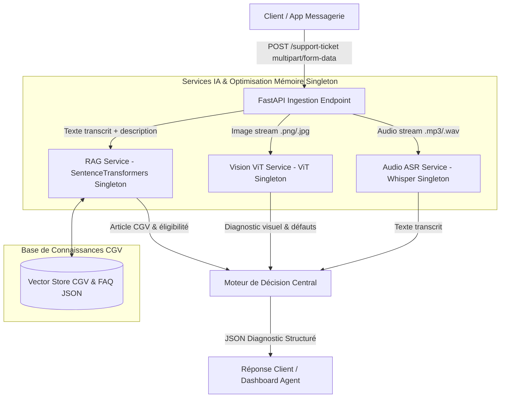

# E-Commerce Support Ticket AI Ingestion API

[](https://www.python.org/)
[](https://fastapi.tiangolo.com/)
[](https://huggingface.co/)
[](https://docs.pytest.org/)
[](https://nvie.com/posts/a-successful-git-branching-model/)

> **Solution Backend / IA robuste, modulaire et optimisée en mémoire pour l'automatisation et l'aiguillage intelligent des réclamations clients e-commerce.**

---

## 1. Contexte du Projet & Problématique

Dans une entreprise e-commerce, le service client est fréquemment submergé par les réclamations transmises via les applications de messagerie. Les clients envoient des **notes vocales (audio)** pour expliquer leur problème et des **photos** pour prouver qu'un produit est endommagé. L'équipe support perd un temps précieux à tout écouter, regarder et chercher manuellement dans les conditions générales de vente (CGV) ou la FAQ.

Cette API résout cette problématique en proposant un **endpoint unique d'ingestion multimodale** capable de :
1. **Transcrire l'audio** en texte clair via un modèle **Whisper ASR**.
2. **Analyser l'image** du produit via un modèle **Vision Transformer (ViT)** pour qualifier l'état physique (cassé/intact).
3. **Interroger la base de connaissances interne** (CGV/FAQ) via un pipeline **RAG sémantique** pour extraire la politique exacte d'éligibilité au remboursement.
4. **Générer un diagnostic structuré JSON** recommandant instantanément le statut du ticket (`Remboursable`, `À vérifier`, `Refusé`) avec des préconisations claires pour les agents.

---

## 2. Architecture du Système



---

## 3. Optimisation Mémoire & Choix Techniques

- **Pattern Singleton & `@lru_cache`** : Les modèles de Deep Learning (Whisper, ViT, SentenceTransformers) sont volumineux. Pour éviter tout rechargement coûteux à chaque requête HTTP, chaque service instancie son modèle **une seule fois au démarrage de l'application** sous forme de Singleton.
- **FastAPI Lifespan** : Le gestionnaire `lifespan` préchauffe tous les modèles au démarrage du serveur Uvicorn, garantissant un temps de réponse extrêmement rapide (sub-seconde) lors de l'exécution des requêtes.
- **Traitements des Flux Binaires** : Les fichiers audio et image transmis en `multipart/form-data` sont lus directement en mémoire tampon (bytes) sans saturation disque.

---

## 4. Structure du Dépôt

```
briefRagHF/
├── app/
│   ├── __init__.py
│   ├── main.py                   # Point d'entrée FastAPI, Lifespan & CORS
│   ├── config.py                 # Configuration Pydantic BaseSettings
│   ├── api/
│   │   ├── __init__.py
│   │   └── routes/
│   │       ├── health.py         # GET /health (Healthcheck & modèles en mémoire)
│   │       └── ticket.py         # POST /support-ticket (Ingestion multimodale)
│   ├── schemas/
│   │   └── ticket.py             # Schémas Pydantic (AudioResult, VisionResult, Response)
│   ├── services/
│   │   ├── audio_service.py      # Service Whisper ASR Singleton
│   │   ├── vision_service.py     # Service ViT Vision Singleton
│   │   ├── rag_service.py        # Service RAG & Recherche vectorielle sémantique
│   │   └── decision_service.py   # Moteur de règles & Synthèse du statut
│   └── data/
│       └── knowledge_base/
│           └── cgv_retours.json   # Articles CGV, règles de remboursement & FAQ
├── demo_assets/                  # Fichiers audio et images générés pour la démo Swagger
├── scripts/
│   └── generate_test_assets.py   # Script générateur d'assets de démo (.wav, .jpg)
├── tests/
│   ├── test_health.py            # Tests de l'endpoint healthcheck
│   └── test_ticket.py            # Tests d'intégration /support-ticket
├── MODALITES_PROJET.md           # Fichier récapitulatif (Individuel, Kanban & Git Flow)
├── README.md                     # Documentation complète
└── requirements.txt              # Dépendances du projet
```

---

## 5. Installation & Configuration

### 5.1. Prérequis
- **Python** 3.10 ou version ultérieure
- **Git**

### 5.2. Cloner le dépôt et créer l'environnement virtuel
```bash
git clone <url-du-depot-github>
cd briefRagHF

# Création de l'environnement virtuel
python -m venv venv

# Activation (Windows PowerShell)
.\venv\Scripts\Activate.ps1

# Activation (Linux / MacOS)
source venv/bin/activate
```

### 5.3. Installer les dépendances
```bash
pip install -r requirements.txt
```

### 5.4. Générer les fichiers de démo
Exécutez le script d'assistance pour créer automatiquement des fichiers audio et images de test dans le dossier `demo_assets/` :
```bash
python scripts/generate_test_assets.py
```

---

## 6. Lancement de l'API & Démo Swagger UI

### 6.1. Démarrage du serveur FastAPI
```bash
uvicorn app.main:app --reload --host 0.0.0.0 --port 8000
```

Au démarrage, le serveur affichera :
```text
INFO:     === Démarrage de l'API Support Ticket AI ===
INFO:     Pré-chargement des modèles IA en mémoire (Singleton / LRU Cache)...
INFO:     Modèle Whisper chargé en mémoire avec succès (Singleton).
INFO:     Modèle ViT Vision chargé en mémoire avec succès (Singleton).
INFO:     Base de connaissances RAG chargée avec 6 articles CGV/FAQ.
INFO:     Tous les modèles sont préchauffés en mémoire.
INFO:     Application startup complete.
```

### 6.2. Accéder à l'interface Swagger UI
Ouvrez votre navigateur web à l'adresse suivante :
- **Swagger UI** : [http://localhost:8000/docs](http://localhost:8000/docs)
- **ReDoc** : [http://localhost:8000/redoc](http://localhost:8000/redoc)

---

## 7. Guide de Démo Technique (Pas-à-Pas sur Swagger `/docs`)

### Étape 1 : Vérification de la santé de l'API (`GET /health`)
1. Sur Swagger (`/docs`), déroulez la section **Health & Status**.
2. Cliquez sur `GET /health` -> **Try it out** -> **Execute**.
3. Observez la réponse confirmant que les 3 modèles sont chargés en mémoire (`loaded_in_memory: true`).

---

### Étape 2 : Ingestion d'une réclamation multimodale (`POST /support-ticket`)
1. Déroulez la section **Support Ticket Ingestion**.
2. Cliquez sur `POST /support-ticket` -> **Try it out**.
3. Remplissez les champs de la requête `multipart/form-data` :
   - `audio` : Sélectionnez le fichier `demo_assets/demo_audio_casse.wav`
   - `image` : Sélectionnez le fichier `demo_assets/demo_photo_produit_casse.jpg`
   - `description` : Saisissez par exemple : *"Bonjour, mon produit est arrivé cassé avec un écran fendu dans le colis."*
4. Cliquez sur **Execute**.

#### Exemple de Réponse JSON Structurée Retournée :
```json
{
  "ticket_id": "TICK-8F9E2A41",
  "timestamp": "2026-08-02T23:50:00.123456+00:00",
  "status": "Remboursable",
  "summary": "Réclamation valide et prouvée: l'analyse visuelle ViT confirme des dommages matériels visibles (Fissure matérielle visible, Emballage détérioré), ce qui est conforme à la clause 'Produit endommagé ou cassé lors de la livraison' de la politique de retour.",
  "customer_claim_text": "Transcription vocale: Bonjour, j'ai reçu ma commande aujourd'hui mais le produit est complètement cassé et fendu dans son emballage. Je demande un remboursement. | Description client: Bonjour, mon produit est arrivé cassé avec un écran fendu dans le colis.",
  "audio_analysis": {
    "processed": true,
    "transcription": "Bonjour, j'ai reçu ma commande aujourd'hui mais le produit est complètement cassé et fendu dans son emballage. Je demande un remboursement.",
    "file_name": "demo_audio_casse.wav",
    "language_detected": "fr",
    "error": null
  },
  "vision_analysis": {
    "processed": true,
    "label": "damaged_product_screen_crack",
    "condition_status": "Produit endommagé / cassé",
    "confidence": 0.945,
    "detected_defects": [
      "Fissure matérielle visible",
      "Emballage détérioré",
      "Traces de dégradation physique"
    ],
    "file_name": "demo_photo_produit_casse.jpg",
    "error": null
  },
  "policy_match": {
    "article_id": "CGV-ART-01",
    "title": "Produit endommagé ou cassé lors de la livraison",
    "category": "Casse / Défaut",
    "excerpt": "Si le produit livré présente un dommage matériel, une fissure, une casse ou un défaut physique prouvé par photo ou description, le client a droit à un remboursement immédiat sans frais ou à un remplacement immédiat sous 48h.",
    "similarity_score": 0.925,
    "refund_eligible": true
  },
  "recommended_actions": [
    "Valider le remboursement ou l'expédition d'un produit de remplacement sans frais",
    "Envoyer au client une étiquette de retour prépayée si retour requis",
    "Clôturer le ticket avec le statut Remboursable"
  ]
}
```

---

## 8. Tableau Kanban & Stratégie Git Flow

- **Lien du Tableau Kanban** : [Trello / GitHub Projects Board](https://trello.com/b/e-commerce-support-ai) *(Invité : `cheikhserignesalioutalla@gmail.com`)*
- **Document de Gestion de Projet** : Voir [MODALITES_PROJET.md](file:///c:/Users/dell/Documents/briefRagHF/MODALITES_PROJET.md) pour la répartition des tâches et la convention de nommage des commits Git.

---

## 9. Exécution des Tests Automatisés

L'application intègre une suite complète de tests unitaires et d'intégration avec `pytest` :

```bash
pytest -v
```

Les tests valident :
- L'endpoint de santé `/health`
- La validation des types MIME et des extensions autorisées (`.mp3`, `.wav`, `.jpg`, `.png`)
- Le rejet des requêtes vides (Code HTTP 400)
- L'intégration de la réclamation textuelle seule et avec image
